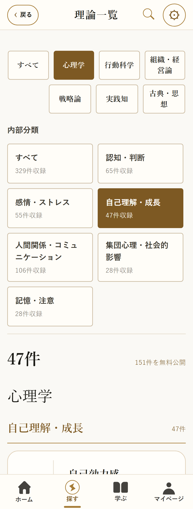

# 理論一覧の内部分類と表示方式

2026-10-07。6大分類を維持し、48内部分類を33の広い内部分類へ再構成。大分類ごとに内容に合う基準を採用し、古典・思想は東洋思想・西洋思想・兵法・ことわざ／格言・文学で整理する。

大分類または内部分類を選択した一覧は全件を見出しで整理し、数字のページボタンを表示しない。全体の「すべて」だけ100件単位の既存ページ切り替えを使う。大分類・内部分類・ページボタンは角丸4pxと明確な枠線へ変更。内部分類はスマホ2列・広い画面3列にし、長い名称は折り返す。

794理論の安定ID・本文・大分類・表示番号・アクセス区分・関連リンク・出典を維持。心理技法は扱う対象へ移し、注意の5理論は記憶・注意へ分類する。分類内の元の順序を保ちながら連番を振り直す。統合した内部分類の旧URLは新分類へ解決する。

## 本番データ

- 正本: Supabase `psfexomjhivqieehcrzx` の `public.theories`。
- 本番・ローカルの本文ハッシュ: `186d7298d9cf5729a531fc7ebf507132`。変更前後で一致。
- 適用移行: `20261006155211_broad_theory_sections.sql`。Supabaseが記録したUTCのversionを使用。
- 適用前に同じSQLをトランザクション内で実行し、検証後rollback。
- 正本の件数・本文・旧分類・分類定義のハッシュを確認してから変更。並行編集があれば中断する。
- 既存owner専用 `theory_taxonomy_backups` に799理論行と48分類行を退避。キーは `theory-sections-20261007`。
- 分類・順番・更新日時以外の全フィールドが元のスナップショットと一致すること、分類内の連番、完全版本文の投影をトランザクション内で検証。
- 適用後: 公開794件、分類33件、未分類0件、有料投影の分類不一致0件、旧ID投影の不一致0件。

## 検証

- TypeScript・ESLint・関連リンク・商品範囲・権利・学習監査が合格。
- unitテストで本文ハッシュ、全ID、分類所属、旧ID・旧本文キャッシュ・検索・旧分類URLを検証。
- 関連ブラウザ検査19件が合格。全体100件ページ切り替え、分類内106件の全件表示、URL復元、CMS、完全版本文と出典、旧ID、320pxのボタン形状・横幅を確認。
- Web出力成功、SEO監査合格。有料本文2732fingerprintを1553ファイルと照合し、流出0件。
- GitHubのPR検査とPages公開ワークフローでも全ブラウザ検査を実行する。

## 復元

復元前にその時点のCMS編集を退避し、バックアップキーの `theory_subcategories` を戻してから `theories` の分類・順番を戻す。本文・権限・IDを上書きしない。ローカル対応は `theory-sections-20261007-before.json` とplan JSONに保存。Web公開後に必要な場合はコードも対応する版へ戻す。

今回の公開対象は https://app.shoseijutsuroku.com/theories のWeb版。iOSバイナリの再配信は含まない。
