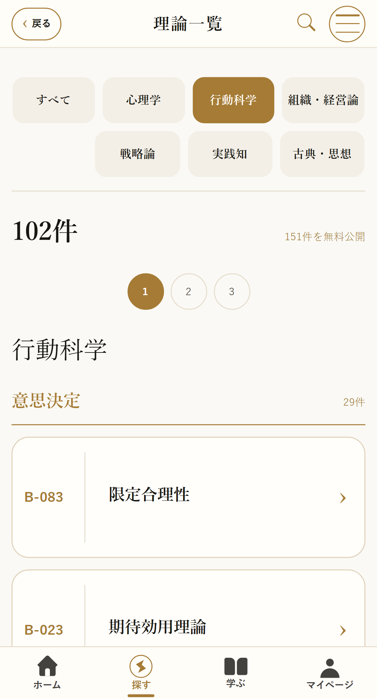
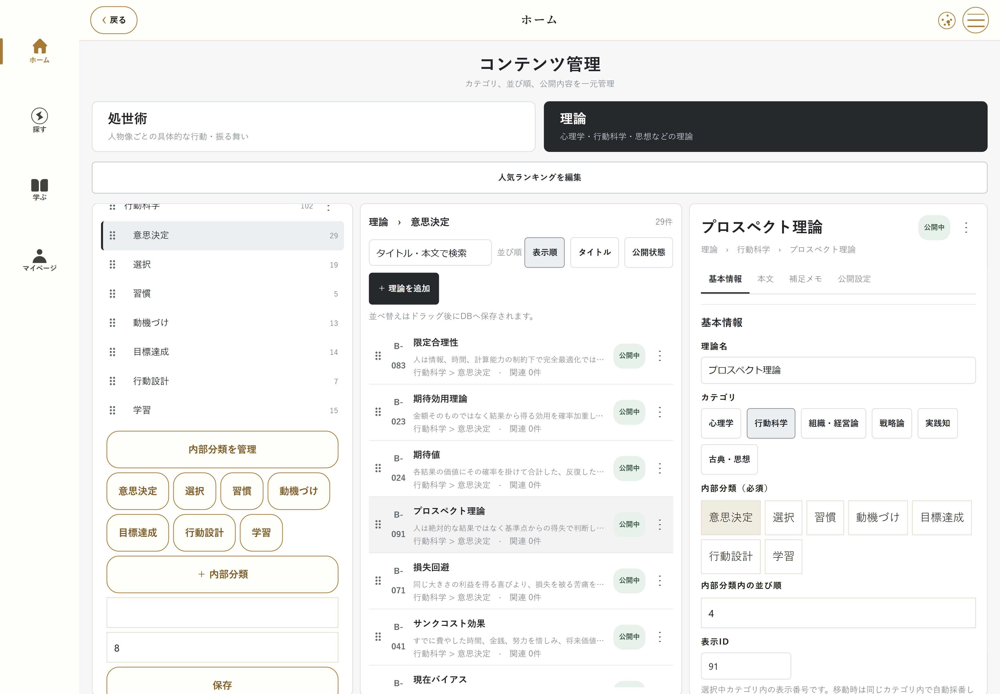

# 理論再構成の検証記録

検証日: 2026-10-04。正本は本番Supabase `psfexomjhivqieehcrzx` の `public.theories`。作業ブランチは `codex/theory-taxonomy-759`。古い349/386/630件のJSONと別チェックアウトは編集していない。

## 正本と同期経路

| 対象 | 参照先と役割 |
|---|---|
| 一覧・詳細の初期データ | `src/data/catalog.ts` → `generated/theories.public.json` |
| 公開メタデータ同期 | `src/lib/published-content.ts` → DBビュー `public_theories`、`theory_subcategories` |
| 完全版の本文 | 認証・利用権を検証する `paid-content` Edge Function → `paid_content` |
| オーナーCMS | `src/data/owner-theories.ts`、`owner-cms.ts` → `theories`、下書き・公開RPC |
| 完全版本文の同期 | `theories` の更新トリガーから `paid_content` へ投影。JSONから正本へ一括上書きしない |
| 保存・閲覧履歴 | `@shoseijutsu-roku/state/v1` を復元時にcanonical IDへ変換。未知のIDは破棄しない |
| 処世術・理論リンク | 安定IDで保持。表示番号は外部参照IDとして使わない |

変更前の759件と最新759件カタログのID・タイトル・本文・大分類は一致した。比較用MD5は `041403168f4b650ab737b95454c42ffa`。再構成後のDBと生成カタログ754件のID・タイトル・大分類・内部分類・表示番号・順番も照合し、不一致0件。

## 本番DBに適用した移行

| DB履歴と一致するファイル | 内容 |
|---|---|
| `20261004133610_theory_internal_taxonomy.sql` | 47内部分類、759件の主分類、5同義組の統合と旧ID、リンク移行、CMS RPC、本文投影 |
| `20261004134150_theory_taxonomy_permissions.sql` | 新RPCの明示的な匿名実行権限の削除、owner RLS、FKインデックス |
| `20261004135302_theory_title_alias_polish.sql` | 所属欲求の英語併記を表示タイトルから別名へ移動 |

移行本体は件数・正本ハッシュを照合し、テーブルロックとトランザクションで適用する。同一内容であることを生成スクリプトでも確認済み。ファイル名はSupabaseが記録した適用versionへ揃えた。バックアップ識別子 `20261004125754` は本体の適用済みSQLに含まれる元の識別子であり、変更しない。

`supabase/tests/theory_taxonomy.sql` は既存ownerの権限で分類の追加・改名・順番変更・空分類削除、使用中分類の削除拒否、理論順番変更、不正IDの拒否、新規下書きの保存・公開・大分類移動、未指定・不一致内部分類の拒否を確認する。匿名権限の書き込み拒否と有料本文非公開も確認する。テストはトランザクションをrollbackし、監査用データを残さない。本番適用前の移行全体のrollback検査と、3移行適用後のowner・guest検査が合格した。

| 本番DBの最終確認 | 結果 |
|---|---:|
| 公開canonical理論 | 754 |
| 保管行（旧5IDを含む） | 759 |
| 旧クライアント向け公開ビュー | 759 |
| 無料理論 | 151 |
| 有料本文投影の欠損 | 0 |
| 本文投影のタイトル・内部分類・順番不一致 | 0 |
| 旧IDの有料本文互換投影の欠損 | 0 |
| 旧IDの解決漏れ | 0 |
| DB内の処世術→理論リンク切れ | 0 |
| DB内の理論→理論リンク切れ | 0 |

新しい分類テーブルはRLS有効。追加したowner専用RPCは匿名から実行不可、内部補助関数はauthenticatedからも直接実行不可。Supabase advisorsで今回追加した過剰な権限・冗長SELECTポリシーを修正済み。既存公開ビューは有料本文を隠してメタデータだけを返す設計のため、既存のsecurity-definer-view指摘は残る。匿名の直接テーブル読取へ変更して有料メタデータを消す変更は行っていない。

## ローカルで完了した検査

| 検査 | 結果 |
|---|---|
| 全unitテスト `node --test tests/unit/*.test.mjs` | 21件合格。759旧ID、保存復元、754タイトルと別名の検索、親子・対照概念、内部分類順番、旧本文キャッシュも検査 |
| 実践知5件・分類4件・モバイル2件のブラウザ検査 | 11件合格 |
| 起動カバー消去後の分類・CMS画面再検査 | 分類4件合格、画像を保存 |
| TypeScript、ESLint | 合格 |
| 正本・無料/完全版範囲・権利・学習・双方向リンク監査 | 合格。理論リンク1248、主要431、補足817 |
| Web静的出力 | 成功。旧IDの詳細ルートも出力 |
| SEO・有料本文流出監査 | 合格。281 indexable URL、151理論URL、2569有料本文fingerprintを1513ファイルと照合 |

全体のリリースブラウザ検査、SEO・有料本文流出検査は既存GitHub Pages公開ワークフローでも必須となる。今回の759件互換テストもCIへ追加した。公開先は既存の [処世術禄Web版](https://app.shoseijutsuroku.com/theories)。公開コミットと成功したデプロイはGitHub Actionsの実行履歴で確認できる。

## 編集判断とレビュー

全759件に明示的な主分類・内部分類・順番を指定した。語句一致だけで分類していない。タイトル・別名・本文の類似候補抽出は287661組を比較し、候補は定義を確認した。類似率は同義の証明ではなく、候補発見の補助として扱う。

同義5組だけを統合した。初頭効果／親近効果、プロスペクト理論／損失回避、理論／対処法などは別カードのまま。既存の複合カードは勝手に別名やA/B/Cへ変換していない。分類・名称・複合カード23項目と未統合候補6組は `theory_classification_review.md` に残した。

再分類で古典・思想へ移した `kb_560` 目的論には元から処世術リンクがないため、件数合わせのリンクを追加しない。従来の古典61件が全てリンクされていることは引き続き検査する。全754件中、処世術との関連がない理論135件は検索・一覧・詳細から閲覧でき、リンク切れではない。

## 画面証跡

## 保全と復元

変更前の正本759件、既存RPC・ガード定義はこのディレクトリのbefore JSONに保存した。DBのowner専用 `theory_taxonomy_backups` は元の理論、処世術、下書き、ランキング、SNSリンク1120行を保持する。旧理論5行は物理削除していない。

復元する場合は、現在のCMS編集を先に退避し、バックアップ識別子の行から対象を特定して単一トランザクションで復元する。既存RPC・ガードを戻す場合はfunctions-before/guards-beforeも参照し、有料本文投影とリンクを再監査する。新しいユーザーの保存データが既にcanonical IDを使っているため、旧ID解決を無条件に削除しない。iOSの新しいバイナリ配信はこのWeb公開に含まれない。
